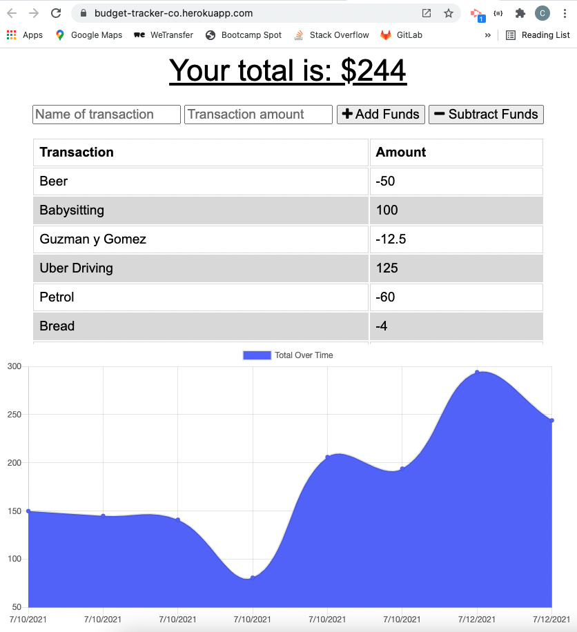
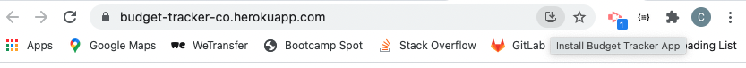

# budget-tracker
A budget tracker that can be used both online and offline.  If entries are recorded whilst offline, they will be populated to mongo as soon as user is online again.  In the interim they are held in the indexed db storage.  

## Description & LIVE DEPLOYED WEBSITE
---
The app can be viewed live [here](https://budget-tracker-co.herokuapp.com/).  
Simply add a transaction to the budget tracker by providing the name and amount, and then use the add or subtract button depending on whether money is coming in or going out.  You'll see the total amount available change based on the income and expediture.  To download the application to your desktop, you can click the 'install budget tracker' icon found on the RHS of the address bar in google chrome.     

## Screenshots
---
The following images show the web application's appearance and functionality: 
The main page which has the inout fields and add / subtract buttons. 

The install button can be found on the RHS of the address bar

## Tools & Technologies
---
    - express, mongoose and mongodb
    - dotenv to hide personal data
    - indexDB to store the data whilst offline
    - webpack and babel to produce the manifest
    - service worker to manage the intercept and manage the online/offline lifecycles

## Installation
---
Step 1 - Clone the github repo

Step 2 - Enter your mongodb_uri in the EXAMPLE .env file and save as .env

Step 3 - Right click the server.js file and `Open in intergrated Terminal`, and run `npm install` to install dependancies

Step 4 - Enter `npm start` to open the server connection

Step 5 - Open your browser and enter`localhost:3000`

## Questions?
---
If you have any questions about this project, please contact me directly on [email](mailto:catormerod@gmail.com). You can view more of my projects at [Github](https://github.com/catormerod) or this specific project at [budget-tracker](https://github.com/CatOrmerod/budget-tracker). 

The app can be viewed live [here](https://budget-tracker-co.herokuapp.com/). 
